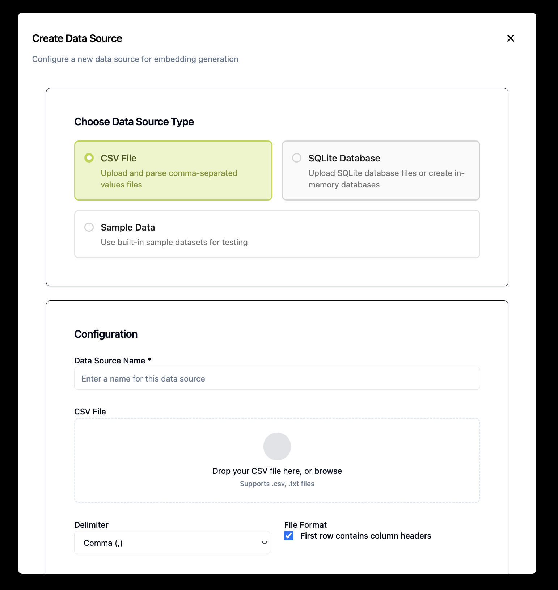
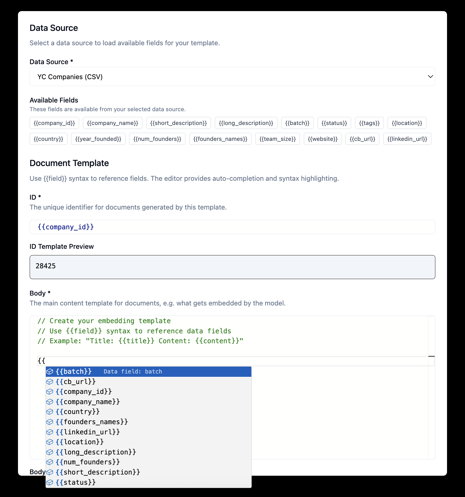
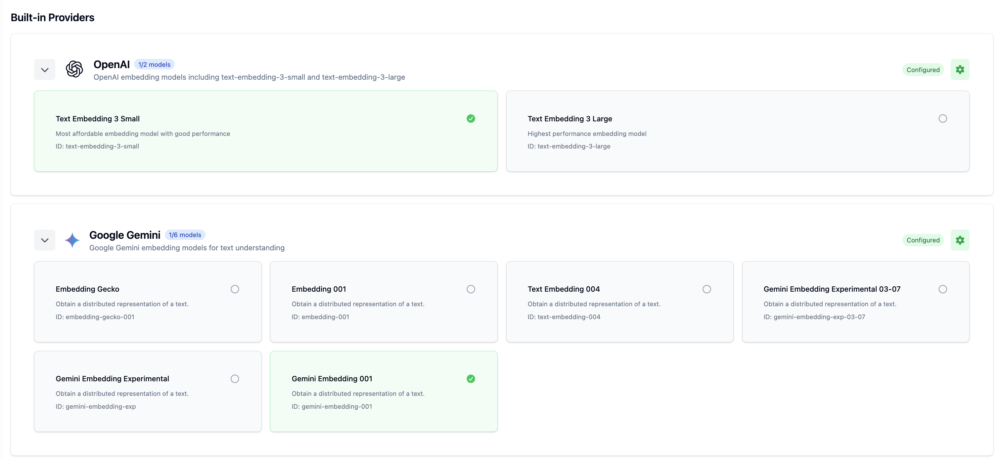
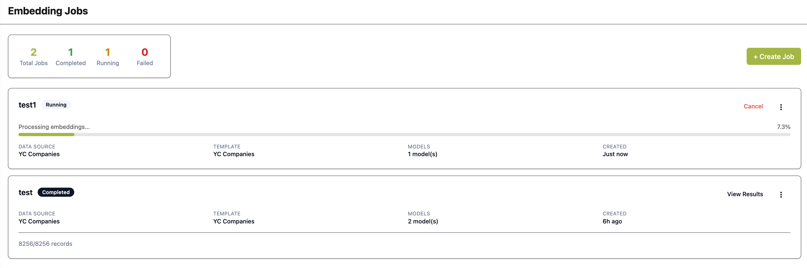
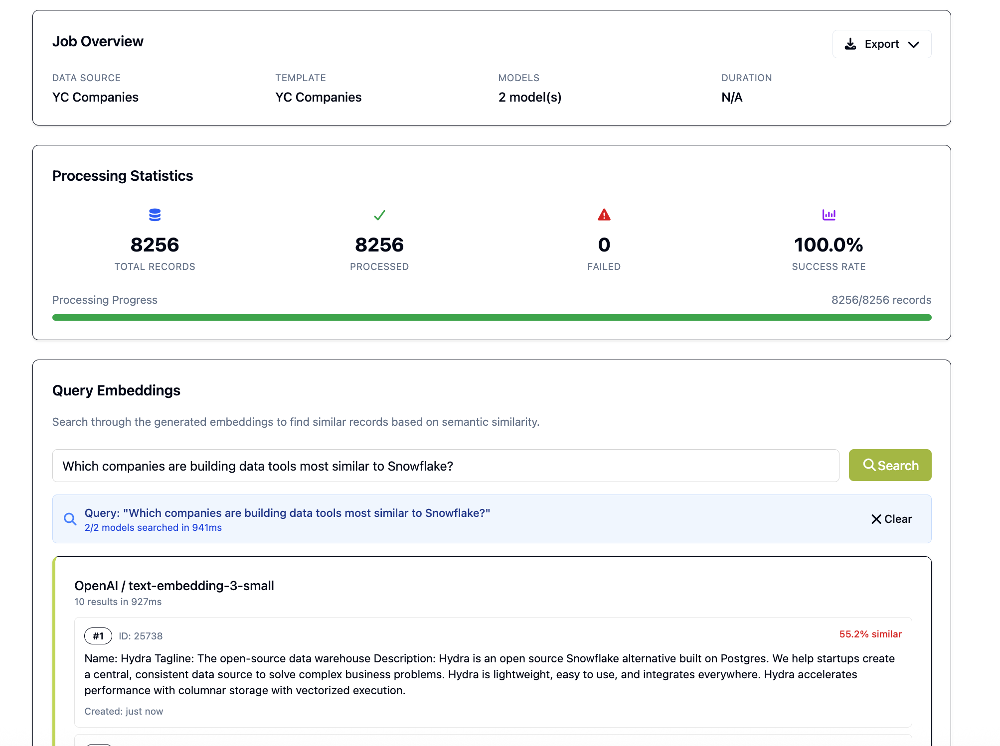

# Embedding Explorer

Minimal web app for experimenting with and comparing text embedding models. It lets you ingest data, generate embeddings using different providers, store them, and run fast similarity searches so you can evaluate model quality side‑by‑side. All local to your browser.

## Live Demo

🔗 **[Try it live](https://dnys1.github.io/embedding_explorer/)**

## How It Works

Choosing an embedding model is tedious: you repeat ad‑hoc scripts, switch endpoints, and copy/paste vectors into notebooks. This tool gives you a consistent 4-step workflow:

### 1. Connect Your Data Sources



Start by connecting to your data - upload CSV files, connect to SQLite databases, or use sample datasets. Configure how your data should be processed and prepared for embedding generation.

### 2. Create Embedding Templates



Design templates that structure your data for optimal input to embedding models. Define how fields should be combined, formatted, and preprocessed before being sent to embedding providers.

### 3. Configure Embedding Providers



Set up multiple embedding providers and models you want to test. Configure API keys, model parameters, and provider-specific settings to compare different approaches side-by-side.

### 4. Run Jobs and Analyze Results




Execute embedding jobs across your chosen providers, monitor progress, and analyze results. Compare model performance through similarity searches, inspect vector distances, and evaluate which models work best for your specific use case.

## Tech Stack

- **Dart** – Single language for UI, background workers, and data tasks
- **Jaspr** – Dart web framework for rendering + interactive components
- **libSQL** – Persistent store for documents, metadata, and embedding vectors
  - Uses the experimental [libSQL WASM](https://github.com/tursodatabase/libsql-wasm-experimental) package for browser storage via OPFS

## Core Features

- Multi‑model embedding generation
- Vector storage & similarity (k‑NN / cosine) queries
- Interactive comparison view (result lists per model)
- Batch ingestion & re‑embedding jobs with progress tracking

## Project Layout

```
lib/
	database/        # libSQL pool, migrations, transactions
	embeddings/      # Embedding services & interop
	data_sources/    # Data acquisition & ingest logic
	jobs/            # Background / batch job abstractions
	storage/         # Storage service abstractions
	util/            # Shared helpers (logging, retry, etc.)
	workers/         # Generated worker entrypoints
web/                 # Front-end entrypoint & static assets
test/                # Unit & integration tests
```
